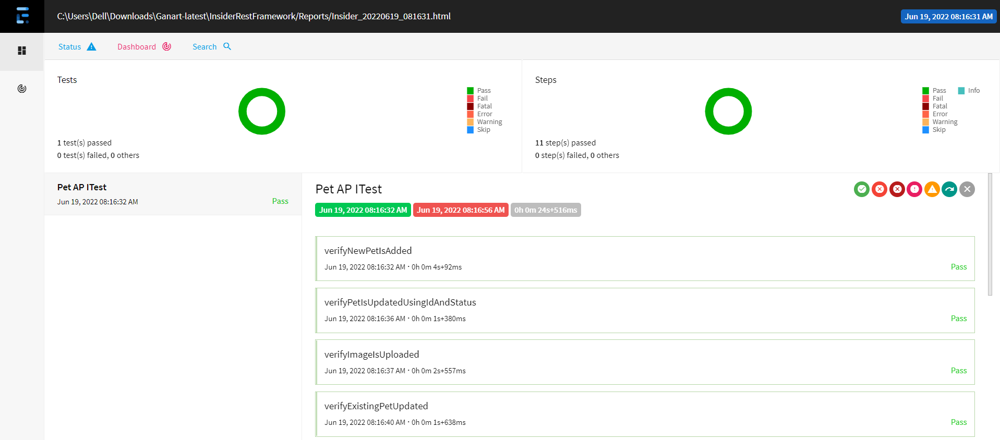

𝐆𝐄𝐓𝐓𝐈𝐍𝐆 𝐒𝐓𝐀𝐑𝐓𝐄𝐃:

	This is a maven based framework used for Pet Swagger via RestAssured for Api Testing
	This framework requires following prerequisites.

𝐓𝐀𝐁𝐋𝐄𝐒 𝐎𝐅 𝐂𝐎𝐍𝐓𝐄𝐍𝐓𝐒:

    Pre-requisites | Dependencies | Installation | Execution | Reports And Output

𝐏𝐑𝐄-𝐑𝐄𝐐𝐔𝐈𝐒𝐈𝐓𝐄𝐒:

	Jdk 8
	Maven 3.8.6
	TestNg 7.4.0
 	eclipse Ide 2022/03
 
 
𝐃𝐄𝐏𝐄𝐍𝐃𝐄𝐍𝐂𝐈𝐄𝐒 𝐑𝐄𝐐𝐔𝐈𝐑𝐄𝐃:

 	1.testNg 7.4.0
 	2.json-simple 1.1.1
 	3.json-schema-validator 4.3.3
 	4.json-path 2.4.0
 	5.jackson-databind 2.13.3
 	6.rest-assured 4.3.3
 	7.extentreports 4.0.9
 
𝐈𝐍𝐒𝐓𝐀𝐋𝐋𝐀𝐓𝐈𝐎𝐍:

 	1.Pull the code from the Repository.
 	2.For Eclipse->Run as -> Maven clean. 
 	3.Run as -> Maven Install. 
 	4.Clean the project.
	
𝐄𝐗𝐄𝐂𝐔𝐓𝐈𝐎𝐍:

	Right click on start.java and select -> Run as Java application

𝐑𝐄𝐏𝐎𝐑𝐓𝐒 𝐀𝐍𝐃 𝐎𝐔𝐓𝐏𝐔𝐓:
 	
	After Run Extent Report will generate in Reports Folder with project name and date.
    

